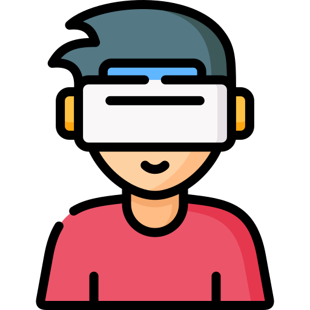

<!-- Header -->

  
  <h1>VR Cognitive Stimulation</h1>
  
  

    A Unity Project! 
  

  
  
<!-- Badges -->

  
  
  
  
  

   

 

<!-- About the Project -->
## :star2: About the Project

VR Cognitive Stimulation is a Unity project. It is developed and tested on the Meta Quest 2 device. It consists of the implementation of a daily life activity for cognitive stimulation. 

  <!-- Features -->
### :dart: Features

- Application of cognitive challenges such as memory, attention and executive function. 🧠 
- Implementation of the "Supermarket Tasks" as a daily life activity. 🛒
- Adjustable difficulty levels. 🎚️
- Feedback at end of level. ✅
- User-friendly interface. 🍃
- Timer to calculate total time to solve each level ⏲️
- Error count. ❌
- ToPay panel for simple Math calcs. 💸
- Random generation of list of products to be memorized. 📝
  - Difficult Easy (10 products of 3 types)
  - Difficult Medium (15 products of 4 types)
  - Difficult Hard (20 products of 5 types)

### Built With

* 
* 

